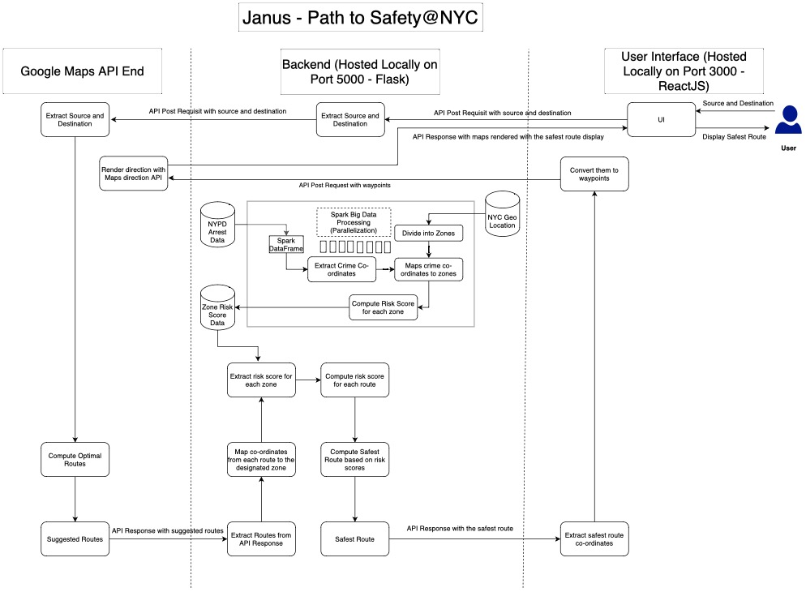

# Janus: Enhancing Pedestrian Safety in NYC through Big Data Analytics

## Overview
Janus is a web application focused on improving pedestrian safety in New York City. Utilizing Big Data analytics and integrating the Google Maps API, the application provides users with optimized routing information that prioritizes safety, leveraging historical crime data from the NYPD to calculate risk scores for various routes.

## Key Features
- **Optimal Route Calculation**: Determines the safest route for pedestrians using crime data analytics.
- **Big Data Processing**: Employs Apache Spark to analyze large datasets for real-time safety assessments.
- **User Interface**: Features an easy-to-use interface developed with ReactJS, allowing users to input their journey's start and end points to receive the safest route recommendations.
 

## Getting Started
1. Clone the repository and set up the local development environment.
2. Ensure you have Python, Flask, and ReactJS installed for backend and frontend operations.
3. Run the Flask server to start the backend service.
4. Launch the React application to access the Janus web interface.
5. Input your travel details to navigate safely across NYC.

###Commands-

Run Flask App:
1. cd backend
2. python -m venv venv
3. source venv/bin/activate
4. Install Flask, flask_restful, flask_cors, googlemaps libraries using pip install
5. run the command: "flask run" to run the flask app.

Run React-Native App:
1. open another terminal and cd to frontend
2. npm install
3. npm start

## Future Enhancements
- Integration of real-time data updates for arrest records.
- Expansion of the UI to display alternative routes with respective risk scores.
- Adoption of Spark Streaming for dynamic data processing.

## License

    Copyright [2023] [Pragnavi Ravuluri Sai Durga]

    Licensed under the Apache License, Version 2.0 (the "License");
    you may not use this file except in compliance with the License.
    You may obtain a copy of the License at

        http://www.apache.org/licenses/LICENSE-2.0

    Unless required by applicable law or agreed to in writing, software
    distributed under the License is distributed on an "AS IS" BASIS,
    WITHOUT WARRANTIES OR CONDITIONS OF ANY KIND, either express or implied.
    See the License for the specific language governing permissions and
    limitations under the License.

